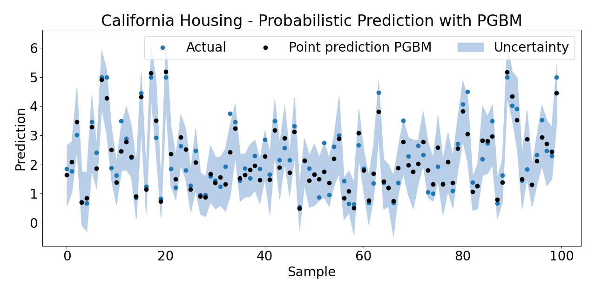

# Quick Start #

First, [install PGBM](./installation.md).

## Training a model (Torch backend) ##
For example, for the California Housing dataset:
```
from pgbm.torch import PGBMRegressor
from sklearn.model_selection import train_test_split
from sklearn.datasets import fetch_california_housing
X, y = fetch_california_housing(return_X_y=True)
X_train, X_test, y_train, y_test = train_test_split(X, y, test_size=0.1, random_state=0)
model = PGBMRegressor().fit(X_train, y_train)  
```
__Point predictions__
You can make point predictions by calling the `predict` attribute of a `PGBM` or `PGBMRegressor` model:
```
yhat_point = model.predict(X_test)
```
__Probabilistic predictions__
You can make probabilistic predictions by calling the `predict_dist` attribute of a `PGBM` or `PGBMRegressor` model. By default, `100` forecasts will be created for each sample using a `normal` distribution (see also [Parameters](./parameters_torch.md)).
```
yhat_dist = model.predict_dist(X_test)
```
__Plotting predictions__
We can plot the results for both the point and probabilistic estimates for the first 100 samples of the test set:
```
import matplotlib.pyplot as plt
import numpy as np
n_samples_plot = 100
plt.rcParams.update({'font.size': 20})
plt.plot(y_test[:n_samples_plot], 'o', label='Actual')
plt.plot(yhat_point[:n_samples_plot], 'ko', label='Point prediction PGBM')
plt.fill_between(np.arange(len(y_test[:n_samples_plot])), 
                 yhat_dist.min(0)[:n_samples_plot], 
                 yhat_dist.max(0)[:n_samples_plot], 
                 color="#b9cfe7", label='Uncertainty')
plt.title('California Housing - Probabilistic Prediction with PGBM')
plt.xlabel('Sample')
plt.ylabel('Prediction')
plt.legend(ncol=3)
```
which should produce something similar to the following:

As you can see, the probabilistic forecast covers most of the actual observed values, which is typically desired. Moreover, the indicated forecast range varies per test point, indicating that the model has learned to produce different variances for various samples. Again, this is typically desired behaviour when forecasting. We can improve on this result through [hyperparameter tuning](./parameters_torch.html#parameter-tuning). 

## Training a model (Scikit-learn backend) ##
For example, for the California Housing dataset:
```
from pgbm.sklearn import HistGradientBoostingRegressor, crps_ensemble
from sklearn.metrics import mean_squared_error
from sklearn.model_selection import train_test_split
from sklearn.datasets import fetch_california_housing
import numpy as np
X, y = fetch_california_housing(return_X_y=True)
X_train, X_test, y_train, y_test = train_test_split(X, y, test_size=0.1, random_state=0)
model = HistGradientBoostingRegressor(random_state=0).fit(X_train, y_train) 
```
__Point predictions__
You can make point predictions by calling the `predict` attribute of a `HistGradientBoostingRegressor` model, and we also return the standard deviation of our predictions by setting `return_std=True`:
```
yhat_point, yhat_point_std = model.predict(X_test, return_std=True)
```
__Probabilistic predictions__
You can make probabilistic predictions by calling the `sample` attribute of a `HistGradientBoostingRegressor` model. By default, `1` forecast will be created for each sample using a `normal` distribution (see also [Parameters](./parameters_sklearn.md)).
```
yhat_dist = model.sample(yhat_point, yhat_point_std, n_estimates=1000, random_state=0)
```